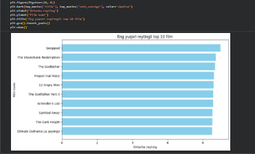
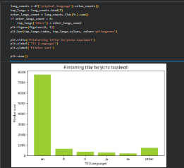
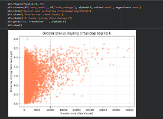
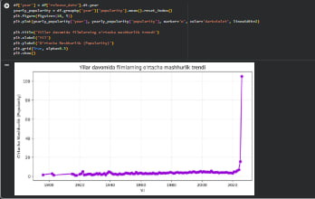

# 🎬 Movie Dataset Data Cleaning & Analytics

Ushbu loyihada filmlar ma'lumotlar to'plami (Movies Dataset) Pandas yordamida tozalandi, tahlil qilindi va Matplotlib yordamida vizualizatsiya qilindi.

## 📁 Loyiha Strukturasi
* `data/` - Asl va tozalangan CSV ma'lumotlar
* `notebooks/` - Ma'lumotlarni tozalash va EDA jarayoni (Jupyter Notebook)
* `images/` - Matplotlib vizualizatsiyalari (.png)
* `dashboard/` - Power BI fayli va dashboard skrinshoti

## 📊 Ma'lumotlar Tahlili va Vizualizatsiya Natijalari

### 1. Eng yuqori reytingga ega top 10 ta film

### 2. Filmlarning tillar bo'yicha taqsimoti

### 3. Ovozlar soni va Reyting o'rtasidagi bog'liqlik

### 4. Yillar davomida filmlarning o'rtacha mashhurlik trendi

## 🖥️ Power BI Dashboard
*(Power BI dashboardingiz tayyor bo'lgach, skrinshotini `dashboard/dashboard_view.png` qilib saqlang va quyidagi qatorni faollashtiring)*
<!--  -->
